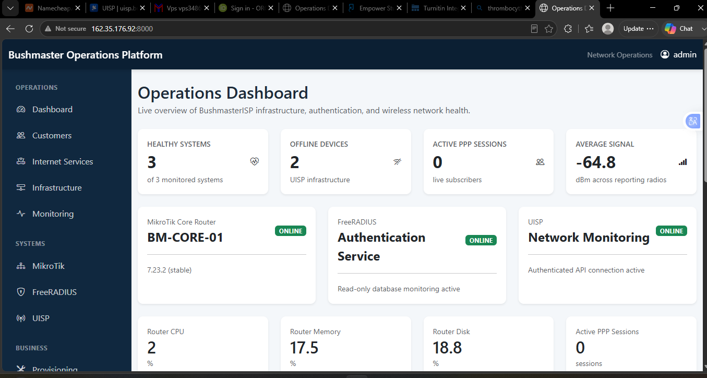
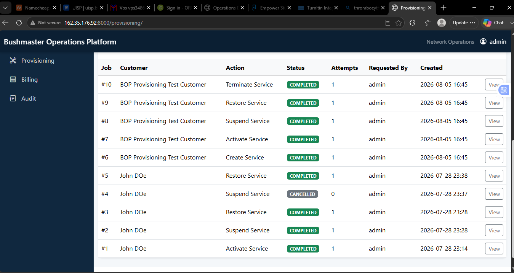
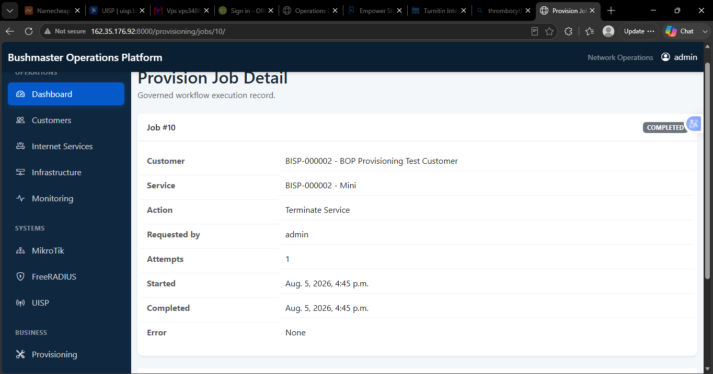

# Bushmaster Operations Platform (BOP)

---

## Enterprise OSS/BSS Platform

Bushmaster Operations Platform (BOP) is a commercial Operations Support System /
Business Support System (OSS/BSS) designed for Wireless Internet Service Providers.

The platform automates subscriber lifecycle management,
network provisioning,
authentication,
monitoring,
billing,
CRM,
customer self-service,
and infrastructure management.

---

# Current Status

Commercial Development

Current Milestone:

v0.6 – Governed Provision Jobs

---

# Technology Stack

- Python

- Django

- PostgreSQL

- Bootstrap 5

- HTMX

- MikroTik RouterOS API

- FreeRADIUS

- UISP API

---

# Completed Features

✔ Customer Management

✔ Internet Services

✔ Service Plans

✔ Devices

✔ Workflow Engine

✔ Rollback Engine

✔ Provisioning

✔ Activation

✔ Suspension

✔ Restoration

✔ Termination

✔ Provision Jobs

✔ Infrastructure Dashboard

✔ Provisioning Console

✔ Audit Framework

✔ MikroTik Integration

✔ FreeRADIUS Integration

✔ UISP Integration

---

# Planned Features

⬜ Billing

⬜ CRM

⬜ Customer Portal

⬜ Mobile Application

⬜ REST API

⬜ Multi-Tenant Support

⬜ Reporting Engine

---

# Architecture

                    Customer Portal

                           │

                           ▼

                  Workflow Engine

                           │

       ┌───────────┬────────────┬────────────┐

       ▼           ▼            ▼

   MikroTik    FreeRADIUS      UISP

---

# Repository

The production source code is maintained in a private repository.

This repository exists to document the architecture,
engineering progress,
and feature roadmap.

---

# Lead Architect

Dr Ududua E. Omokaro

Founder

Triple J Technologies Ltd.

Nigeria

---

# Platform Screenshots

## Operations Dashboard

Real-time operational visibility across the BOP infrastructure stack, including
MikroTik, FreeRADIUS, UISP, subscriber sessions, device health, and network
performance indicators.

---

## Provisioning Console

Centralized subscriber lifecycle management with governed service actions and
provision-job tracking.

---

## Provision Job Detail

Detailed execution record for governed provisioning workflows, providing
operational traceability and visibility into workflow results.

