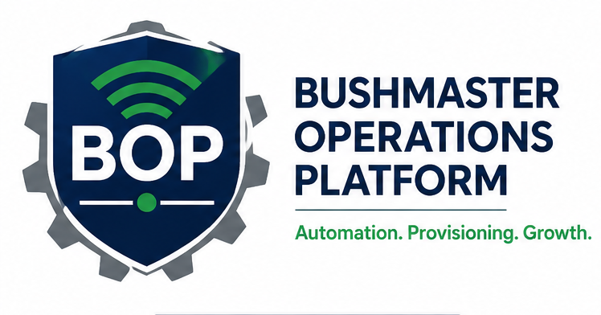
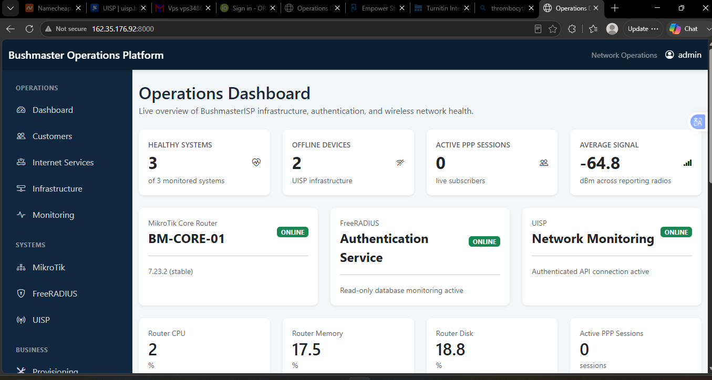
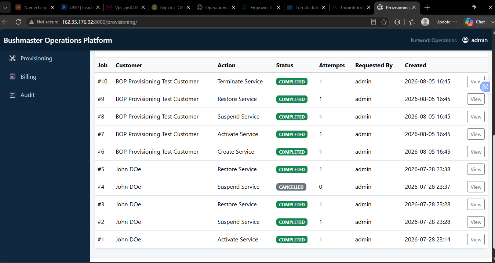
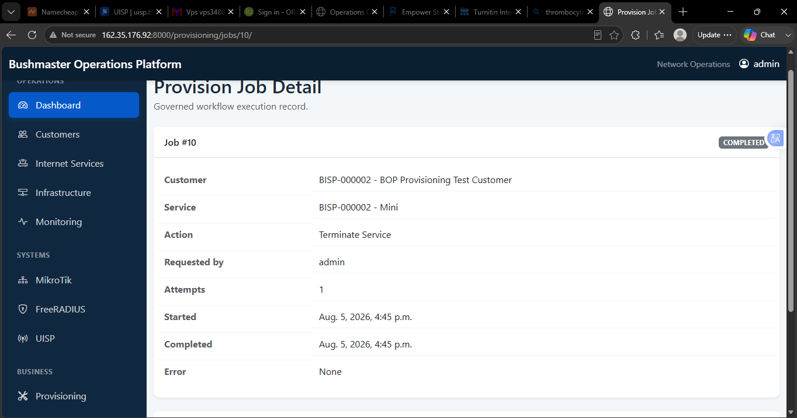

# Bushmaster Operations Platform (BOP)



**Automation. Provisioning. Growth.**

**Release:** `v1.0.0-beta.1` — controlled beta testing

**Documentation:** [Architecture](docs/ARCHITECTURE.md) | [Beta status](docs/PHASE_2_STATUS.md) | [Beta release notes](docs/V1_BETA_RELEASE.md) | [Roadmap](docs/ROADMAP.md) | [Platform screenshots](#platform-screenshots)

---

## Enterprise OSS/BSS platform

Bushmaster Operations Platform (BOP) is a commercial Operations Support System /
Business Support System (OSS/BSS) designed for wireless Internet service
providers. It brings subscriber lifecycle management, network provisioning,
authentication, monitoring, billing, customer self-service, communications and
infrastructure operations into one governed platform.

## Current status

**Version 1 Beta 1 — updated 5 September 2026**

The current BOP milestone is deployed for controlled beta testing. It combines
the ISP operations console, automated billing, customer self-service, Paystack
checkout, network visibility and governed subscriber workflows with the Jerou
Hospital staff captive-access and registered-device pilot.

Production-impacting actions remain role-governed, independently switched,
audited and rollback-capable. This beta milestone is not the final general-
availability `v1.0.0` release.

See [Beta status](docs/PHASE_2_STATUS.md) for the activation boundary.

## Technology stack

- Python and Django
- MariaDB
- Bootstrap 5 and progressive JavaScript
- MikroTik RouterOS API
- FreeRADIUS authentication and accounting
- UISP monitoring and CRM import APIs
- Paystack payments
- Mapbox network mapping
- BulkSMSNigeria, Meta WhatsApp Cloud API and Brevo delivery adapters

## Implemented capabilities

- Customer, service-plan and Internet-service management
- Governed provision, activate, suspend, restore and terminate workflows
- Cross-system verification, rollback evidence and immutable audit history
- MikroTik PPPoE and subscriber-session integration
- FreeRADIUS authentication, authorization and accounting integration
- UISP customer/service import and Ubiquiti device monitoring
- Automated billing cycles, invoice lifecycle, payment allocation and overdue tracking
- Isolated customer self-service portal with Paystack invoice checkout
- Consent-aware SMS, WhatsApp and email reminder orchestration
- D-3 through D+3 reminder policy with idempotent delivery evidence
- Infrastructure dashboard, reconciliation console and traffic correlation
- UISP/Mapbox network topology and device-location map
- Governed surveillance and hospital-device identity inventory
- Jerou staff self-service enrollment, FreeRADIUS credentials and speed/data policies
- Captive access for unknown hospital devices with registered-device exemptions
- Verified EdgeRouter DHCP reservations and daily hospital-device usage controls
- Role-governed Sentinel AI operations assistant
- Role-aware staff access and operational audit controls

## Controlled activation items

- Live SMS is gated pending sender-ID approval and a controlled delivery pilot.
- Meta WhatsApp delivery is gated pending production credentials, a registered
  phone-number ID and an approved utility template.
- Brevo email delivery is gated pending a verified sender, production credential
  and a controlled delivery pilot.
- Subscriber disconnection remains separate from reminder delivery and cannot be
  activated until the paying-subscriber PPPoE access-binding and rollback gates
  are complete.
- Jerou captive access is in controlled beta. Downstream wireless equipment must
  operate in access-point/bridge mode so BOP can identify each client device.

## High-level architecture

```text
        Staff Operations Console       Isolated Customer Portal
                   |                              |
                   +--------------+---------------+
                                  |
                     Workflow and Billing Engine
                                  |
          +-----------------------+-----------------------+
          |                       |                       |
      MikroTik                FreeRADIUS                UISP
   access enforcement        AAA/accounting       device monitoring
                                  |
                  Paystack and notification providers
```

## Repository

The production source code is maintained in a private repository. This public
repository documents product architecture, engineering progress, capabilities
and the roadmap without publishing proprietary source code, credentials or
operational infrastructure details.

## Lead architect

Dr Ududua E. Omokaro, founder of El-Trivant Technologies Ltd., Nigeria.

## Platform screenshots

### Operations dashboard

Real-time operational visibility across the BOP infrastructure stack, including
MikroTik, FreeRADIUS, UISP, subscriber sessions, device health and network
performance indicators.



### Provisioning console

Centralized subscriber lifecycle management with governed service actions and
provision-job tracking.



### Provision job detail

Detailed execution evidence for governed provisioning workflows, including
operational traceability and workflow outcomes.


